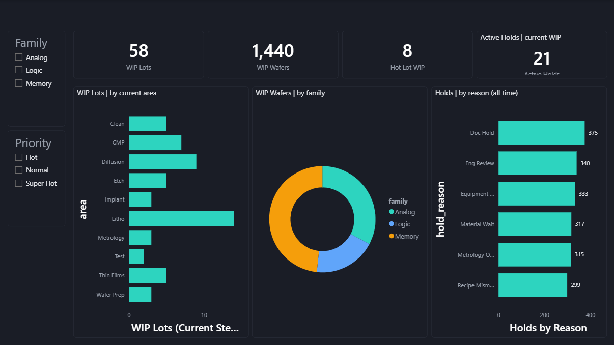
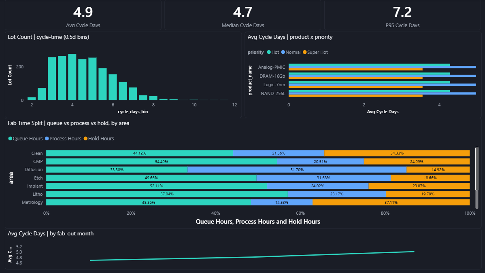
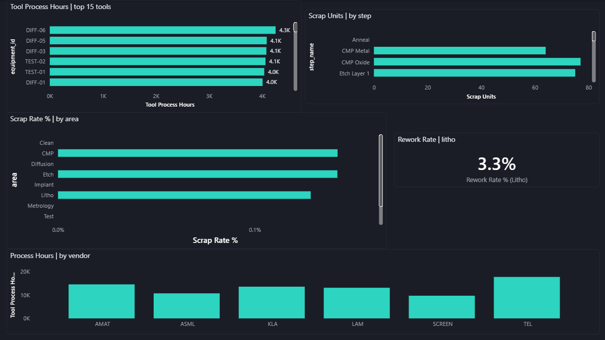
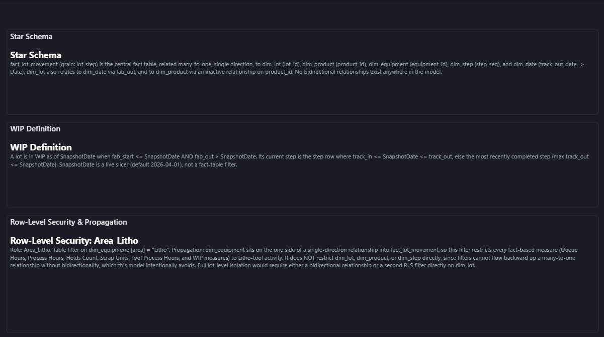
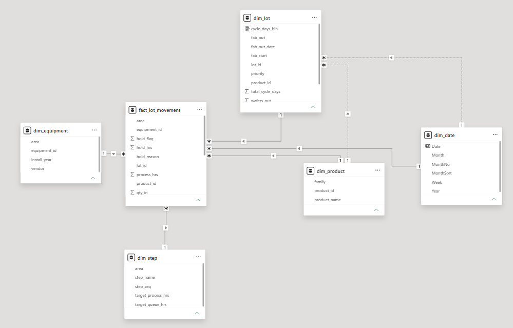

# Fab WIP & Cycle Time Analytics

Production-style **semiconductor fab MES analytics** in Power BI — 2,000 lots
moving through a 20-step manufacturing flow, modeled the way I build for
production: star schema, snapshot-based WIP logic, row-level security, and
version-controlled TMDL source.

> Data is synthetic (generated to mirror real MES lot-movement structures).
> The modeling patterns are the ones I use in production for global
> semiconductor manufacturing clients.

**Author:** Sohail Ahamad — Senior BI Engineer, 10+ years in manufacturing
analytics (Power BI · Grafana · Tableau · Snowflake · ClickHouse · SQL Server).
PL-300 & PMP certified.

---

## Report pages

| Page | What it shows |
|---|---|
| **WIP Overview** | Snapshot WIP by area and family, hot-lot count, active holds vs all-time holds |
| **Cycle Time** | Cycle-time distribution (0.5-day bins), product × priority comparison, queue-vs-process-vs-hold time split by area, fab-out trend |
| **Equipment & Quality** | Top-15 tool loading, scrap by step and area, litho rework rate, vendor split |
| **Model & Governance** | Star schema documentation, WIP definition, RLS role and propagation notes |







## Engineering decisions worth reading

**Snapshot-based WIP.** Every lot in the dataset completes the flow, so "current
WIP" only exists relative to a point in time. A `SnapshotDate` parameter drives
all WIP measures: a lot is in WIP when `fab_start <= snapshot < fab_out`, and
its current step is resolved from track-in/track-out intervals. Naive
`MAX(step)` approaches return zero or everything — the snapshot logic is what
makes the numbers mean something.

**Single-direction filtering, deliberately.** `dim_lot` sits on the one-side of
the fact relationship and receives no filter context from `dim_product`. Instead
of the bidirectional-relationship shortcut (which invites ambiguity and breaks
RLS reasoning), lot-grain measures bridge context explicitly with
`TREATAS ( VALUES ( dim_product[product_id] ), dim_lot[product_id] )`.

**RLS with documented propagation.** Role `Area_Litho` filters
`dim_equipment[area] = "Litho"` and propagates one-direction into the fact. The
governance page documents exactly what the role does and does not restrict —
because knowing the propagation limits of an RLS design matters as much as
having one.

**Honest denominators.** Rework is a litho phenomenon, so the rework rate is
computed over litho rows only (~3%), not diluted across the full fact table
(~0.5%). Cycle-time statistics include completed lots only.

## Model

Star schema — `fact_lot_movement` (grain: lot-step, 40k rows) related
many-to-one, single direction, to `dim_lot`, `dim_product`, `dim_equipment`,
`dim_step`, and `dim_date`; inactive relationships for fab-out-date trends
(via `USERELATIONSHIP`) and lot→product bridging.

## Repo structure

```
├── Fab WIP & Cycle Time Analytics.pbip
├── Fab WIP & Cycle Time Analytics.SemanticModel/   # TMDL source — tables, relationships, measures, RLS
├── Fab WIP & Cycle Time Analytics.Report/          # PBIR report definition
├── fabdata/                                        # synthetic MES dataset (5 CSVs)
├── FabDark.json                                    # custom report theme
└── CLAUDE.md                                       # governed spec used for AI-assisted development
```

Built as a **.pbip project** — the full semantic model is readable, diffable
TMDL text under Git. Development was AI-assisted under a governed
specification (`CLAUDE.md`): model rules, validation expectations, and
workflow guardrails were defined up front; every change was validated against
expected values (WIP ≈ 58 lots at the default snapshot, family split
≈ 48/33/19, litho rework ≈ 3%).

## Reproduce

1. Clone the repo.
2. Open `Fab WIP & Cycle Time Analytics.pbip` in Power BI Desktop
   (enable *Power BI Project* preview feature).
3. Update the five CSV paths in Power Query to your local `fabdata/` folder
   and refresh.

## Contact

Open to freelance BI engagements — dashboard development, legacy report
migration (SSRS → Power BI / Grafana), data modeling, and query optimization.

- LinkedIn: [linkedin.com/in/sohail-ahamad-pmp](https://www.linkedin.com/in/sohail-ahamad-pmp/)
- Fiverr: [fiverr.com/sohailahamadg](https://www.fiverr.com/sohailahamadg)
